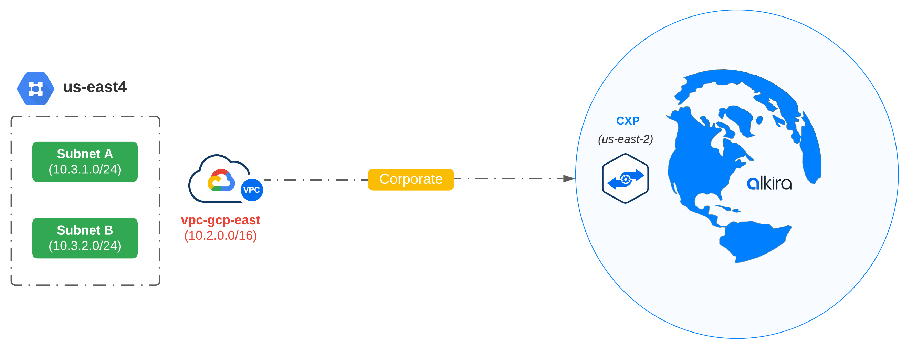

## Single VPC + Connector
This configuration creates the following:
- Single GCP VPC
- Two subnets
- Connector to Alkira

> The connector will use an existing Alkira segment, group, and billing tag provided in the configuration.

### Usage
```bash
$ terraform init
$ terraform plan -out=tfplan
$ terraform apply "tfplan"
```

### Topology
